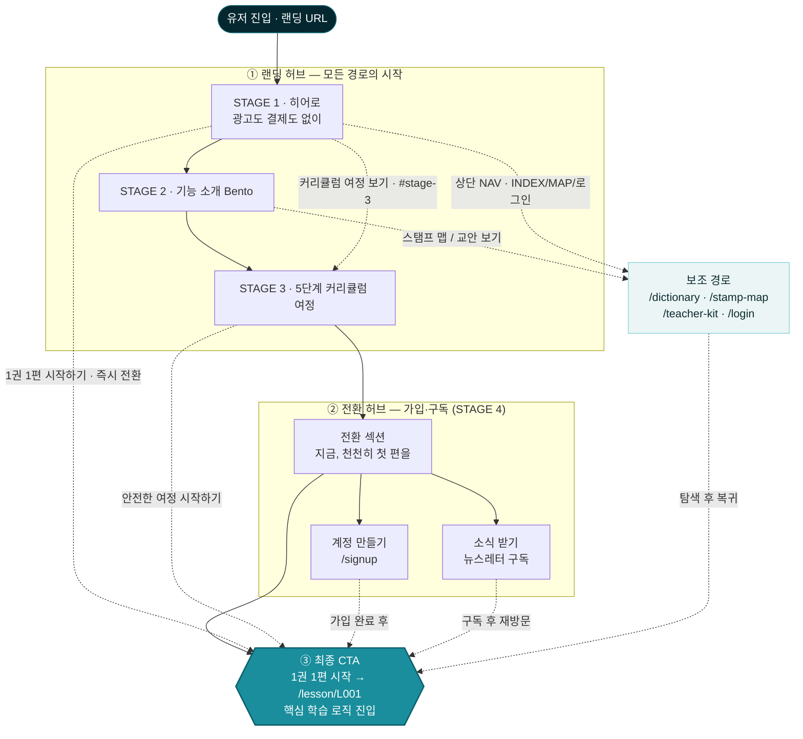

# UX 퍼널 플로우차트 — 랜딩 → 핵심 CTA

> 작성일: 2026-06-13
> 분석 대상: `3ECO-prototypes/3ECO-claude-v1/goyo-prototype/src/app/page.tsx` (랜딩페이지)
> 범위: 유저 진입 → 핵심 CTA 로직(첫 강의 진입) 도달까지의 Funnel

## 코드에서 확인된 전환 경로

- **히어로(STAGE 1)**: `1권 1편 시작하기 → /lesson/L001`(즉시 전환), `커리큘럼 여정 보기 → #stage-3`(앵커 점프)
- **기능 소개(STAGE 2)**: `스탬프 맵 → /stamp-map`, `교안 → /teacher-kit`
- **커리큘럼 여정(STAGE 3)**: `안전한 여정 시작하기 → /lesson/L001`
- **전환 섹션(STAGE 4)**: `계정 만들기 → /signup`, `소식 받기(뉴스레터 구독)`, `강의 둘러보기 → /lesson/L001`
- **최종 CTA** = `/lesson/L001` (핵심 학습 로직 진입)

## 퍼널 플로우차트

## 범례 / 퍼널 해석

- **실선(`-->`)**: 의도된 메인 스크롤 흐름 — 랜딩 허브 → 전환 허브 → 최종 CTA의 3단 스파인.
- **점선(`-.->`)**: 점프 경로 — 단계를 건너뛰는 앵커/직행/이탈·복귀.
- 이 사이트는 결제가 없는 구조라 "플랜/구독"의 전환 허브는 **계정 만들기(/signup)** + **뉴스레터 구독(소식 받기)** 으로 매핑했고, 최종 전환 목표는 **첫 강의 진입(/lesson/L001)** 이다.
- 주목할 점: 히어로에서 `1권 1편 시작하기`가 **퍼널 전체를 건너뛰고 최종 CTA로 직행**하는 강한 점프 경로라, 전환 허브(가입·구독)를 거치지 않고 핵심 로직에 도달하는 비중이 클 수 있다(가입 유도와 즉시 학습 진입이 경쟁 관계).
